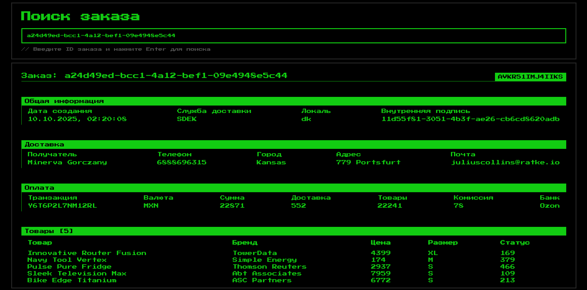
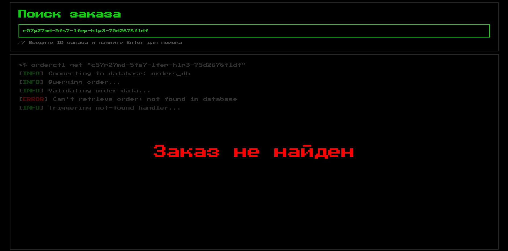
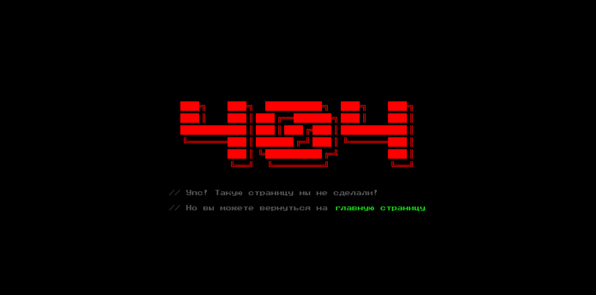
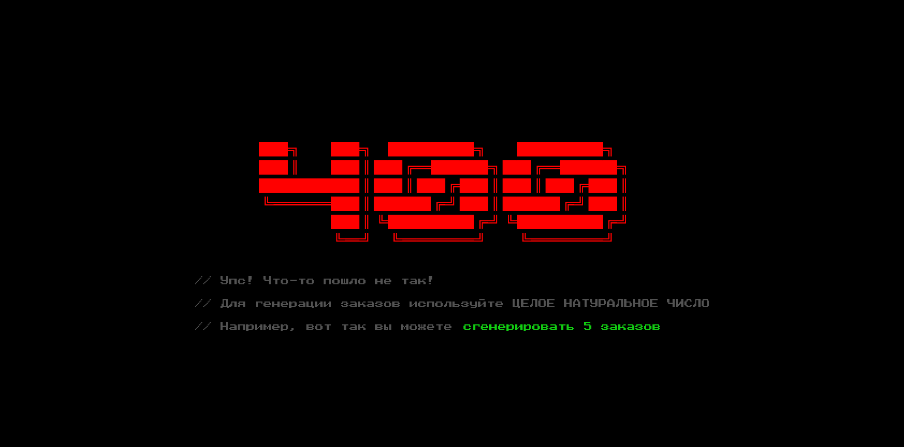
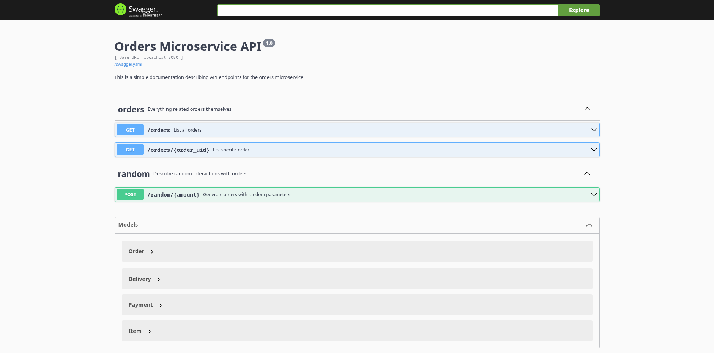
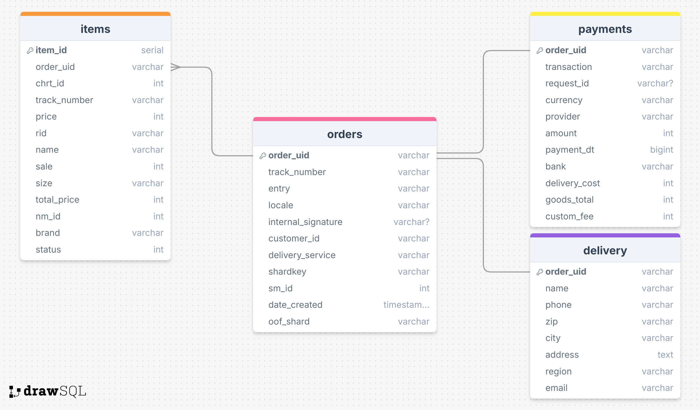

# Orders Microservice
**Сервис для обработки и отображения данных заказа с использованием Kafka, PostgreSQL и Redis.**

## Скриншоты






## Функционал
- Генерация и отправка заказов в топик
- Получение данных о заказе из Kafka
- Сохранение полученных заказов в PostgreSQL
- Кэширование новых заказов для быстрого доступа
- Кэширование последних заказов на старте сервиса
- HTTP API для получения данных о заказе по ID
- Минималистичный интерфейс для просмотра заказов

## Технологии
- **Язык:** Golang 1.23.5
- **База данных:** PostgreSQL 17.6
- **Кэш:** Redis – Sorted Set (LRU)
- **Брокер сообщений:** Bitnami/Kafka (Legacy)
- **Контейнеризация:** Docker, Docker Compose
- **Веб-сервер:** net/http
- **SQL-Go код:** sqlc
- **Документация:** Swagger

## Установка и запуск
### Требования и зависимости
1) Установите Docker и Docker Compose на вашу систему соответствующим образом

### Подготовка к запуску
1) Перейдите в директорию, куда хотите сохранить сервис или создайте новую:
```
mkdir <YOUR-DIRECTORY-NAME> && cd <YOUR-DIRECTORY-NAME>
```
2) Клонируйте репозиторий проекта внутри директории:
```
git clone https://github.com/xvnvdu/orders-microservice.git
```
3) Запустите сборку и ожидайте ее окончания:
```
docker compose up -d
```

Эта команда запустит контейнеры в фоновом режиме:
- Сам сервис на порту **8080**
- PostgreSQL на порту **5432**
- Redis на порту **6379**
- Kafka на порту **9092**

4) Проверьте успешность запуска по логам:
```
docker logs orders-microservice-backend-1
```
В случае успешного запуска интерфейс будет доступен в вашем любимом браузере на ```localhost:8080```

### Основные эндпоинты
- ```/orders``` – список всех сохраненных заказов в формате JSON
- ```/orders/{order_uid}``` – информация о заказе в формате JSON, где ```{order_uid}``` – ID заказа
- ```/random/{amount}``` – генерация заказов, где ```{amount}``` – число генерируемых заказов 
- ```/docs``` – мини-документация Swagger 

### Полезное
1) Вы можете посмотреть список всех контейнеров (в том числе неактивные) и их статусы:
```
docker ps -a
```
2) Для взаимодействия с бд напрямую через контейнер используйте:
```
docker exec -it orders-microservice-db-1 psql -U orders_user -d orders_db 
```
Для выхода используйте ```exit```

3) Прекратить работу контейнеров:
```
docker compose down
```
Для очистки томов добавьте флаг ```-v```

## Архитектура
1) **```cmd/server/main.go```**
- Основной исполняемый файл. 
- Инициализирует переменные окружения, зависимости и само приложение
- Запускает HTTP-сервер

2) **```internal/app/app.go```**
- Ядро приложения
- Управляет всеми процессами сервиса: запуск/остановка
- Хранит в себе продюсера, консьюмера и подключение к бд
- Выполняет обработку хэндлеров

3) **```internal/cache/cache.go```**
- Redis кэш на основе LRU
- Основная логика кэширования данных:
    - Инициализация кэша
    - Заполнение кэша на старте сервиса
    - Обновление кэша при взаимодействии с заказами из бд

4) **```internal/database/```**
- Сгенерированная с помощью sqlc директория для взаимодействия с бд
- Описаны основные модели, структура заказов
- Хранит SQL-Go функции для модифицирования базы данных напрямую

5) **```internal/generator/```**
- Директория генерации случайных заказов:
    - Содержит основной скрипт для генерации ```generator.go```
    - Реализованы вспомогательные модели для структуры заказов

6) **```internal/kafka/```**
- Ключевая логика брокера сообщений Kafka:
    - Консьюмер создает новый топик на старте сервиса и слушает сообщения фоном
    - Продюсер сообщений записывает сгенерированные заказы в топик
    - Консьюмер пытается сохранить полученное сообщение с заказами в бд
    - При неудаче сохранения в бд сообщение НЕ коммитится и повторно обрабатывается в будущем

7) **```internal/repository/repository.go```**
- Модуль для взаимодействия с сохраненными данными
- Инициализация и проверка успешного подключения к бд
- Хранит в себе объекты самой базы данных и кэша
- Сохраняет заказы в бд, извлекает их из кэша и бд

8) **```sql/```**
- Стартовый скрипт инициализации таблиц для базы данных
- Основные sql-запросы для взаимодействия с бд

9) **```web/```**
- Содержит статику и шаблоны для web-страниц

10) **```docs/```**
- Документация Swagger, написанная в ```.yaml``` формате
- Описывает API-эндпоинты сервиса
- Рендерится на запуске программы в ```cmd/server/main.go```
- Доступ к документации через ```/docs/index.html``` (редирект через ```/docs```)

11) **```.env```**
- Переменные окружения, используемые приложением:
    - Строка подключения к PostgreSQL
    - Данные пользователя, название самой бд
    - Строка подключения к Redis

12) **```Dockerfile```** и **```docker-compose.yaml```**
- Файлы конфигурации Docker-окружения
- Создание образа приложения через ```Dockerfile```
- Инструкции для запуска основной инфраструктуры и самого сервиса в отдельных контейнерах 

13) **```sqlc.yaml```**
- Инструкция для генерации SQL-Go команд через sqlc

## Структура базы данных


## Демо сервиса
#### https://disk.yandex.ru/i/eF3stexR_e1CRw
